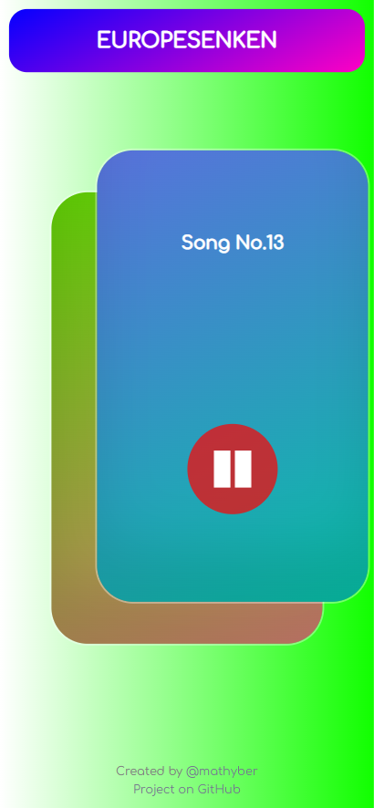
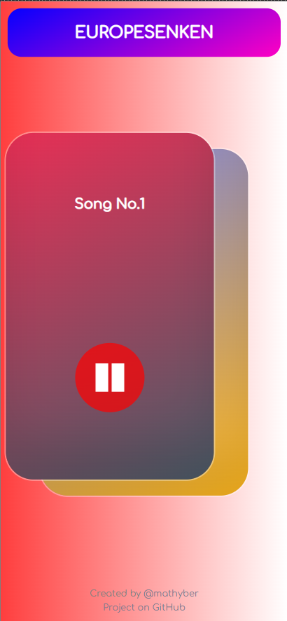
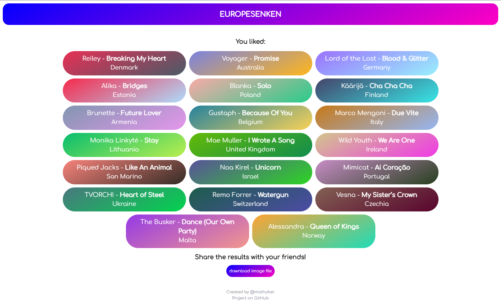

# EUROPESENKEN

Europesenken — a site where you can rate the songs of Eurovision 2026 in Tinder format by swiping cards left (dislike) or right (like).

 



## Features

- **Swipe cards** — swipe right to like a song, left to skip
- **Result screen** — see all your liked songs after swiping through the full list, with audio preview and a shareable image export
- **Global Scoreboard** — a public leaderboard at `/scoreboard` showing all Eurovision 2026 songs ranked by the number of likes from all users, with a percentage bar and total voter count

## Getting Started

### Prerequisites

- Node.js 18+
- A [Supabase](https://supabase.com) project with the required tables and edge functions

### Environment variables

Create a `.env.local` file in the project root:

```
VITE_SUPABASE_URL=your_supabase_project_url
VITE_SUPABASE_ANON_KEY=your_supabase_anon_key
```

### Supabase setup

Install the [Supabase CLI](https://supabase.com/docs/guides/cli) and log in:

```bash
npm install -g supabase
supabase login
```

Link to your project (find `<project-ref>` in the Supabase dashboard URL):

```bash
supabase link --project-ref <project-ref>
```

Apply database migrations (creates the `votes`, `sessions` tables and `scoreboard` view):

```bash
supabase db push
```

Deploy the edge functions. The `--no-verify-jwt` flag is required because users are anonymous (no auth token):

```bash
supabase functions deploy create-session --no-verify-jwt
supabase functions deploy submit-vote --no-verify-jwt
```

### Install & run

```bash
npm install
npm start        # dev server
npm run build    # production build
npm run preview  # preview the production build locally
```
